# Mini App Bridge Test Project

<div align="center">
  
</div>

A production-ready mini app ecosystem test environment for learning and testing JavaScript bridge patterns used in super apps (WeChat, Alipay style). This project demonstrates secure bidirectional communication between a host application and embedded mini apps with complete payment verification flow.

## 🏗️ Architecture Overview

### Current Implementation (Web Host)

```mermaid
graph TB
    subgraph ENV ["🌐 Complete Test Environment"]
        subgraph BROWSER ["Browser"]
            subgraph HOST ["🏦 Host App (Bank Simulation)"]
                subgraph FLUTTER ["📱 Flutter Mini App (Bus Booking)"]
                    BRIDGE["🔗 JavaScript Bridge<br/>• User Info Exchange<br/>• PIN Validation (0000/1111/2222)<br/>• Payment Initiation<br/>• Ticket Delivery"]
                end
            end
        end

        BACKEND["🚀 Go Backend API Server<br/>• Bus routes management<br/>• Booking creation & confirmation<br/>• Payment processing & validation<br/>• In-memory storage"]
    end

    HOST -->|HTTP API + CORS| BACKEND
    BRIDGE -.->|PostMessage API| HOST

    style ENV fill:#f9f9f9,stroke:#333,stroke-width:2px
    style HOST fill:#e1f5fe,stroke:#01579b,stroke-width:2px
    style FLUTTER fill:#f3e5f5,stroke:#4a148c,stroke-width:2px
    style BRIDGE fill:#fff3e0,stroke:#e65100,stroke-width:2px
    style BACKEND fill:#e8f5e8,stroke:#1b5e20,stroke-width:2px
```



### React Native Alternative

```mermaid
graph TB
    subgraph MOBILE ["📱 Mobile Device"]
        subgraph RN_HOST ["🏦 React Native Host App"]
            subgraph WEBVIEW ["🌐 WebView Container"]
                subgraph RN_FLUTTER ["📱 Flutter Web Mini App"]
                    RN_BRIDGE["🔗 React Native Bridge<br/>• WebView postMessage API<br/>• Native payment integration<br/>• Same backend communication"]
                end
            end
        end

        RN_BACKEND["🚀 Go Backend API Server (Identical)<br/>• Same endpoints and logic<br/>• Universal CORS configuration<br/>• Platform-agnostic payment flow"]
    end

    RN_HOST -->|Same HTTP API| RN_BACKEND
    RN_BRIDGE -.->|WebView postMessage| RN_HOST

    style MOBILE fill:#f9f9f9,stroke:#333,stroke-width:2px
    style RN_HOST fill:#e3f2fd,stroke:#0d47a1,stroke-width:2px
    style WEBVIEW fill:#f1f8e9,stroke:#33691e,stroke-width:2px
    style RN_FLUTTER fill:#fce4ec,stroke:#880e4f,stroke-width:2px
    style RN_BRIDGE fill:#fff8e1,stroke:#ff6f00,stroke-width:2px
    style RN_BACKEND fill:#e8f5e8,stroke:#1b5e20,stroke-width:2px
```



## 🎯 Learning Objectives

- **Bridge Pattern Implementation**: Understand how super apps communicate with mini apps
- **Secure Payment Flow**: Learn backend verification of payments with audit trail
- **Message Passing**: Master bidirectional postMessage communication with type safety
- **State Management**: Handle user state and payment flows across app boundaries
- **Error Handling**: Implement comprehensive error handling with retries and fallbacks
- **Testing Strategies**: Test with both mock and real bridge implementations
- **Security Practices**: Token validation, CORS, and secure API design

## 📦 Tech Stack

- **Backend**: Go 1.21+ with Gin framework
- **Mini App**: Flutter Web with custom bridge services
- **Host App**: Node.js Express server with JavaScript bridge
- **Communication**: PostMessage API, HTTP REST APIs

## 📱 Platform Support

This mini app bridge system supports multiple host platform integrations:

### Current Implementation

- **Node.js Host App**: Express server with iframe-based Flutter integration
- **Flutter Web Mini App**: Runs in browser iframe with PostMessage communication

### React Native Integration Support

The Flutter mini app can also be integrated with React Native apps using WebView:

#### Architecture Comparison

| Platform         | Host Technology   | WebView Component      | Communication Method               |
| ---------------- | ----------------- | ---------------------- | ---------------------------------- |
| **Current**      | Node.js + Express | Browser iframe         | `window.postMessage()`             |
| **React Native** | React Native App  | `react-native-webview` | `ReactNativeWebView.postMessage()` |

#### React Native Setup

**1. Install WebView Package**

```bash
npm install react-native-webview
# For iOS
cd ios && pod install
```

**2. React Native Host Component**

```jsx
import React, { useRef } from "react";
import { WebView } from "react-native-webview";

const FlutterMiniApp = () => {
  const webViewRef = useRef(null);

  const sendUserInfo = () => {
    const userInfo = {
      type: "USER_INFO",
      data: {
        userId: "rn-user-123",
        name: "Ben Minja (FROM RN)",
        email: "ben.rn@email.com",
        phone: "+255712345678",
        token: "rn-token-abc123",
        accountNumber: "5555666677778888",
        dataSource: "REACT_NATIVE",
        bridgeVersion: "1.0.0",
        timestamp: new Date().toISOString(),
      },
    };

    webViewRef.current.postMessage(JSON.stringify(userInfo));
  };

  const handleMessage = (event) => {
    const message = JSON.parse(event.nativeEvent.data);

    switch (message.type) {
      case "READY":
        sendUserInfo();
        break;
      case "INITIATE_PAYMENT":
        handlePaymentRequest(message.data);
        break;
    }
  };

  return (
    <WebView
      ref={webViewRef}
      source={{ uri: "http://localhost:8081" }}
      onMessage={handleMessage}
      javaScriptEnabled={true}
      domStorageEnabled={true}
      allowsInlineMediaPlayback={true}
    />
  );
};
```

**3. Flutter Bridge Adaptation**

The Flutter app would need a React Native-specific bridge:

```dart
// lib/services/react_native_bridge.dart
class ReactNativeBridge extends BankBridge {
  @override
  void _postMessage(Map<String, dynamic> message) {
    // React Native communication
    if (js.context.hasProperty('ReactNativeWebView')) {
      js.context['ReactNativeWebView'].callMethod('postMessage',
        [json.encode(message)]);
    }
  }

  @override
  bool _isHostAppAvailable() {
    // Check for React Native WebView context
    return js.context.hasProperty('ReactNativeWebView');
  }
}
```

**4. Auto-Detection Bridge Factory**

```dart
BankBridge createBridge() {
  // Auto-detect environment and create appropriate bridge
  if (js.context.hasProperty('ReactNativeWebView')) {
    return ReactNativeBridge();
  } else if (html.window.parent != html.window) {
    return BankBridge(); // Web iframe
  } else {
    return MockBridge(); // Standalone
  }
}
```

#### Message Flow Comparison

**Web Host (Current)**:

```
Host App → iframe.contentWindow.postMessage()
Flutter ← window.addEventListener('message')
Flutter → window.parent.postMessage()
Host App ← window.addEventListener('message')
```

**React Native Host**:

```
React Native → webViewRef.postMessage()
Flutter ← window.addEventListener('message')
Flutter → ReactNativeWebView.postMessage()
React Native ← onMessage prop
```

#### Implementation Benefits

- ✅ **Same Backend**: Identical Go API works for both platforms
- ✅ **Same Flutter Code**: 90% code reuse with different bridge implementation
- ✅ **Same Message Format**: Identical JSON message structure
- ✅ **Same Payment Flow**: PIN validation and ticket issuing works identically
- ✅ **Native Performance**: React Native provides native mobile performance

## 🚀 Quick Start

### Prerequisites

- **Go**: Version 1.21 or higher
- **Flutter**: Version 3.9.2 or higher with web support
- **Node.js**: Version 18 or higher
- **Web Browser**: Chrome, Firefox, Safari, or Edge

### Development Setup

1. **Clone and Setup**

   ```bash
   git clone <your-repo>
   cd mini-app-bridge-test
   ```

2. **Start Backend API** (Terminal 1)

   ```bash
   cd backend
   go run cmd/server/main.go
   ```

3. **Start Flutter Mini App** (Terminal 2)

   ```bash
   cd mini_app
   flutter run -d chrome --web-port 8081
   ```

4. **Start Host App** (Terminal 3)

   ```bash
   cd host-app
   npm install
   npm start
   ```

5. **Open Browser**
   ```
   http://localhost:3000
   ```

## 🧪 Testing Workflows

### Phase 1: Backend Only Testing

Test the API endpoints independently:

```bash
cd backend
go run cmd/server/main.go

# Test routes
curl http://localhost:8080/api/routes

# Test booking creation (requires auth token)
curl -H "Authorization: Bearer test-token" \
     -H "Content-Type: application/json" \
     -d '{"route_id":"DSM-MWZ-001","departure_date":"2025-11-20","seat_numbers":["A1"],"user_id":"test-user","passenger_details":[{"name":"Test User","phone":"+255712345678"}]}' \
     http://localhost:8080/api/bookings
```

### Phase 2: Flutter with Mock Bridge

Test the mini app without host dependency:

```bash
cd mini_app
flutter run -d chrome --web-port 8081
```

The app automatically uses `MockBridge` in debug mode:

- Provides fake user data immediately
- Simulates 3-second payment delay
- Always returns successful payment results

### Phase 3: Full Integration Testing

Test complete bridge communication:

```bash
# Ensure all three components are running:
# 1. Backend (port 8080)
# 2. Flutter (port 8081)
# 3. Host app (port 3000)

# Open browser to: http://localhost:3000
```

Expected flow:

1. Host app loads with bank branding and bridge status
2. Flutter mini app loads in iframe with connection verification
3. Bridge initializes and exchanges user info (auto-fill passenger details)
4. User selects seats and fills passenger information
5. Backend creates pending booking with unique ID
6. Host app shows PIN entry screen and processes secure payment
7. Backend verifies payment and issues confirmed ticket with ticket number
8. Flutter displays beautiful ticket with QR code and booking details
9. User can save ticket or book again

## 📁 Project Structure

```
mini-app-bridge-test/
├── README.md                    # This file
├── backend/                     # Go API server
│   ├── cmd/server/main.go       # Server entry point
│   ├── internal/
│   │   ├── handlers/            # HTTP request handlers
│   │   │   ├── routes.go        # Routes endpoints
│   │   │   ├── bookings.go      # Booking endpoints
│   │   │   └── webhooks.go      # Webhook endpoints
│   │   ├── models/              # Data structures
│   │   │   ├── bus_route.go     # Bus route model
│   │   │   └── booking.go       # Booking model
│   │   ├── services/            # Business logic
│   │   │   └── booking_service.go # Booking service
│   │   └── middleware/          # HTTP middleware
│   │       ├── cors.go          # CORS configuration
│   │       └── auth.go          # Authentication
│   ├── go.mod                   # Go dependencies
│   └── README.md                # Backend documentation
│
├── mini_app/                    # Flutter web application
│   ├── lib/
│   │   ├── main.dart            # Flutter app entry
│   │   ├── services/            # Bridge services
│   │   │   ├── bank_bridge.dart # Real bridge implementation
│   │   │   ├── mock_bridge.dart # Testing bridge
│   │   │   └── api_service.dart # Backend API client
│   │   ├── models/              # Data models
│   │   │   ├── bank_user.dart   # User model
│   │   │   ├── bus_route.dart   # Route model
│   │   │   ├── booking.dart     # Booking model
│   │   │   ├── payment_result.dart # Payment result
│   │   │   └── ticket.dart      # Ticket model with verification
│   │   └── pages/               # UI pages
│   │       ├── home_page.dart   # Routes listing
│   │       ├── booking_page.dart # Seat selection with auto-fill
│   │       ├── checkout_page.dart # Payment processing
│   │       ├── ticket_page.dart # Ticket display with QR
│   │       └── success_page.dart # Confirmation
│   ├── web/                     # Web configuration
│   ├── pubspec.yaml            # Flutter dependencies
│   └── README.md               # Mini app documentation
│
├── host-app/                   # Mock banking app
│   ├── server.js               # Express server
│   ├── public/index.html       # WebView page with bridge
│   ├── package.json            # Node.js dependencies
│   └── README.md               # Host app documentation
```

## 🔗 API Endpoints

### Public Endpoints

- `GET /api/routes` - List available bus routes
- `GET /health` - Backend health check
- `POST /webhooks/payment` - Payment webhook (simulated)

### Protected Endpoints (Require Authorization header)

- `POST /api/bookings` - Create new booking
- `GET /api/bookings/:id` - Get booking details
- `POST /api/bookings/:id/confirm` - Confirm payment

### CORS Configuration

The Go backend is configured with permissive CORS settings for development:

```go
// backend/internal/middleware/cors.go
config := cors.Config{
    AllowOrigins:     []string{"*"},        // Allow all origins
    AllowMethods:     []string{"GET", "POST", "PUT", "DELETE", "OPTIONS"},
    AllowHeaders:     []string{"*"},        // Allow all headers
    ExposeHeaders:    []string{"*"},        // Expose all response headers
    AllowCredentials: true,                 // Allow cookies and auth headers
}
```

**Security Note**: In production, replace `AllowOrigins: ["*"]` with specific domains:

```go
AllowOrigins: []string{
    "https://yourdomain.com",
    "https://app.yourdomain.com",
}
```

**Supported Origins** (Development):

- Host App: `http://localhost:3000`
- Flutter App: `http://localhost:8081`
- Backend API: `http://localhost:8080`
- React Native: Any origin via WebView

## 🌉 Bridge Communication Flow

### Communication Methods Comparison

| Platform         | Host → Mini App                      | Mini App → Host                    | Environment Detection       |
| ---------------- | ------------------------------------ | ---------------------------------- | --------------------------- |
| **Node.js Host** | `iframe.contentWindow.postMessage()` | `window.parent.postMessage()`      | `window.parent != window`   |
| **React Native** | `webViewRef.postMessage()`           | `ReactNativeWebView.postMessage()` | `ReactNativeWebView` exists |
| **Standalone**   | N/A (Mock Bridge)                    | N/A (Mock Bridge)                  | No parent window            |

### Bridge Implementation Matrix

| Feature                 | Web Bridge        | React Native Bridge   | Mock Bridge         |
| ----------------------- | ----------------- | --------------------- | ------------------- |
| **User Data**           | From host app     | From React Native app | Hardcoded mock      |
| **Payment Processing**  | Host app PIN flow | RN native payment     | 3s simulation       |
| **Backend Integration** | ✅ Full API calls | ✅ Full API calls     | ❌ Mock responses   |
| **Ticket Display**      | ✅ Real tickets   | ✅ Real tickets       | ✅ Mock tickets     |
| **Error Handling**      | ✅ Real errors    | ✅ Real errors        | ✅ Simulated errors |

### Message Types Supported

| Message Type        | Direction   | Web | React Native | Mock | Purpose                          |
| ------------------- | ----------- | --- | ------------ | ---- | -------------------------------- |
| `READY`             | Mini → Host | ✅  | ✅           | ✅   | Mini app initialization complete |
| `REQUEST_USER_INFO` | Mini → Host | ✅  | ✅           | ❌   | Request user data from host      |
| `USER_INFO`         | Host → Mini | ✅  | ✅           | ✅   | Send user data to mini app       |
| `INITIATE_PAYMENT`  | Mini → Host | ✅  | ✅           | ❌   | Start payment process            |
| `PAYMENT_RESULT`    | Host → Mini | ✅  | ✅           | ✅   | Payment completion result        |
| `TICKET_ISSUED`     | Host → Mini | ✅  | ✅           | ✅   | Final ticket data                |
| `BOOKING_SUCCESS`   | Mini → Host | ✅  | ✅           | ❌   | Booking completion notification  |

### 1. Initialization & User Exchange

```javascript
// Mini App → Host: Ready signal
{ type: 'READY' }

// Host → Mini App: User information with verification data
{
  type: 'USER_INFO',
  data: {
    userId: 'host-app-user-123',
    name: 'Ben Minja (FROM HOST)',
    email: 'ben.test@email.com',
    phone: '+255712345678',
    token: 'host-token-abc123',
    accountNumber: '1111222233334444',
    dataSource: 'HOST_APP',
    bridgeVersion: '1.0.0',
    timestamp: '2025-11-14T10:55:48.386Z'
  }
}
```

### 2. Secure Payment Flow

```javascript
// Mini App → Host: Payment request with booking ID
{
  type: 'INITIATE_PAYMENT',
  data: {
    amount: 90000,
    currency: 'TZS',
    reference: 'REF-1731513600000',
    description: 'Bus ticket: Dar es Salaam to Mwanza',
    bookingId: 'BK-1731513600'
  }
}

// Host processes PIN → Calls Backend API → Confirms payment
// Host → Mini App: Ticket issued (skipping legacy payment result)
{
  type: 'TICKET_ISSUED',
  data: {
    bookingId: 'BK-1731513600',
    ticketNumber: 'TKT-ABC123',
    transactionId: 'TXN-1731513905123',
    amount: 90000,
    currency: 'TZS',
    route: {
      origin: 'Dar es Salaam',
      destination: 'Mwanza'
    },
    passengers: [{ name: 'Ben Minja', phone: '+255712345678' }],
    seatNumbers: ['A1', 'A2'],
    departureDate: '2025-11-20',
    status: 'confirmed',
    qrCode: 'data:image/png;base64,...',
    createdAt: '2025-11-14T10:56:00Z'
  }
}
```

### 3. Security Features

- **Token Validation**: Backend validates host app tokens
- **Amount Verification**: Payment amounts verified against booking
- **Booking Status**: Prevents double confirmation of payments
- **Audit Trail**: Comprehensive logging of all transactions
- **Error Recovery**: Retry logic with exponential backoff

## 🔐 PIN Validation System

The host app includes a comprehensive PIN validation system for testing different payment scenarios:

### PIN Test Cases

| PIN Code | Status         | Behavior                                                            | Use Case                 |
| -------- | -------------- | ------------------------------------------------------------------- | ------------------------ |
| `0000`   | ✅ **Success** | Payment processes normally → Backend confirmation → Ticket issued   | Happy path testing       |
| `1111`   | ❌ **Failed**  | Shows error message → Clears input → Allows retry → No backend call | Error handling testing   |
| `2222`   | ⏳ **Pending** | Shows pending status → 3s manual review → 70% approval rate         | Async payment testing    |
| Others   | ❓ **Invalid** | Shows helpful error with valid PIN examples → Allows retry          | Input validation testing |

### Payment Flow by PIN

```mermaid
flowchart TD
    START([User Enters 4-Digit PIN]) --> CHECK{PIN Value?}

    CHECK -->|0000| SUCCESS[✅ PIN Validation Passes]
    CHECK -->|1111| FAIL[❌ PIN Validation Fails]
    CHECK -->|2222| PENDING[⏳ Triggers Pending Status]
    CHECK -->|Other| INVALID[❓ Invalid PIN]

    SUCCESS --> PROCESS[💳 Local Payment Processing<br/>1.5s delay]
    PROCESS --> BACKEND[🔄 Backend Confirmation API Call]
    BACKEND --> CONFIRMED[✅ Payment Confirmed]
    CONFIRMED --> TICKET[🎫 Ticket Issued to Flutter App]
    TICKET --> DISPLAY[📄 Success Screen Displayed]

    FAIL --> ERROR1[🚫 Error Message Displayed]
    ERROR1 --> CLEAR1[🔄 PIN Input Cleared]
    CLEAR1 --> RETRY1[🔁 User Can Retry]
    RETRY1 --> NOTE1[⚠️ No Backend Calls Made]
    NOTE1 --> START

    PENDING --> REVIEW[🕐 3-Second Manual Review]
    REVIEW --> RANDOM{🎲 Random Outcome<br/>70% Approve / 30% Reject}
    RANDOM -->|Approved| PROCESS
    RANDOM -->|Rejected| ERROR2[🚫 Pending Rejected]
    ERROR2 --> CLEAR2[🔄 Allow Retry]
    CLEAR2 --> START

    INVALID --> HELP[💡 Shows Valid PIN Examples<br/>0000, 1111, 2222]
    HELP --> CLEAR3[🔄 Clears Input]
    CLEAR3 --> START

    style START fill:#e3f2fd,stroke:#1976d2,stroke-width:2px
    style SUCCESS fill:#e8f5e8,stroke:#388e3c,stroke-width:2px
    style FAIL fill:#ffebee,stroke:#d32f2f,stroke-width:2px
    style PENDING fill:#fff3e0,stroke:#f57c00,stroke-width:2px
    style INVALID fill:#fafafa,stroke:#616161,stroke-width:2px
    style DISPLAY fill:#e8f5e8,stroke:#388e3c,stroke-width:3px
```



### Testing PIN Scenarios

To test the complete payment validation system:

1. **Start all three services** (Backend, Host App, Flutter)
2. **Navigate to payment flow** in host app (http://localhost:3000)
3. **Test each PIN scenario**:

   ```bash
   # Success scenario
   Enter PIN: 0000
   Expected: ✅ Payment succeeds, ticket displayed

   # Failure scenario
   Enter PIN: 1111
   Expected: ❌ Error shown, retry allowed

   # Pending scenario
   Enter PIN: 2222
   Expected: ⏳ Pending status, random resolution

   # Invalid scenario
   Enter PIN: 9999
   Expected: ❓ Helpful error with valid PIN list
   ```

### Console Logging

The PIN validation system provides detailed console logging:

```javascript
🔍 === PIN VALIDATION ===
📌 Entered PIN: 0000
✅ PIN Valid - Success
💳 Local payment processed: TXN-1734123456789
🔄 Confirming payment with backend...
✅ Payment confirmed with backend
```

## 🚀 Production-Ready Features

This project includes production-ready patterns:

- ✅ **Security**: Token validation, source verification, audit logging
- ✅ **Error Handling**: Comprehensive error handling with retries and fallbacks
- ✅ **State Management**: Proper booking status lifecycle management
- ✅ **Payment Verification**: Backend confirmation before ticket issuance
- ✅ **Type Safety**: Strongly typed bridge communication
- ✅ **Responsive UI**: Material Design 3 with mobile-first approach
- ✅ **Bridge Patterns**: Real-world super app communication patterns

## ⚠️ Additional Production Considerations

For full production deployment:

- 🔄 Use proper database instead of in-memory storage
- 🔄 Implement real payment gateway integration
- 🔄 Add rate limiting and advanced security headers
- 🔄 Add comprehensive testing (unit, integration, e2e)
- 🔄 Implement proper CI/CD pipelines
- 🔄 Add monitoring and analytics
- 🔄 Implement proper session management

## 🐛 Troubleshooting

### Common Issues

1. **Flutter app not loading in iframe**

   - Ensure Flutter is running on port 8081
   - Check browser console for CORS errors
   - Verify iframe src URL in host-app/public/index.html

2. **Bridge communication failing**

   - Check browser console for postMessage errors
   - Ensure `window.BankApp` is available before bridge init
   - Verify message event listeners are properly set up

3. **API calls failing**

   - Confirm backend is running on port 8080
   - Check CORS configuration in middleware
   - Verify Authorization header format

4. **Payment flow not working**
   - Check bridge logs in host app UI
   - Verify payment data structure matches expected format
   - Ensure timeout values are appropriate

### Debug Mode

The mini app intelligently detects environment:

```dart
// Automatically uses real bridge when in iframe (host app)
final isInIframe = html.window.parent != html.window;
if (isInIframe) {
  _bridge = BankBridge(); // Real bridge with host app
} else {
  _bridge = MockBridge(); // Mock data for standalone testing
}
```

## 🎯 Key Implementation Highlights

### 🔐 Secure Payment Verification Flow

1. **Flutter** creates pending booking with backend
2. **Host app** processes PIN entry and calls backend confirmation API
3. **Backend** verifies payment amount and updates booking status
4. **Host app** receives confirmed ticket data
5. **Flutter** displays ticket via bridge message

### 📱 Smart Environment Detection

- **Standalone mode**: Uses mock data, blocks payments with clear messaging
- **Host app mode**: Connects to real bridge, enables full payment flow
- **Visual indicators**: Green/blue cards show connection status

### 🎫 Complete Ticket Experience

- Beautiful Material Design 3 ticket display
- QR code placeholder for conductor verification
- Complete booking and payment details
- Save/share functionality with return navigation

### 🛡️ Production Security Patterns

- Token source validation (host-token vs mock-token)
- Payment amount verification against booking
- Comprehensive audit logging
- Retry logic with exponential backoff
- Type-safe bridge communication

## 📖 Additional Documentation

- [Backend API Documentation](backend/README.md)
- [Flutter Mini App Guide](mini_app/README.md)
- [Host App Bridge Guide](host-app/README.md)
- **[📦 Distribution Strategy Guide](DISTRIBUTION.md)** - Comprehensive guide on super app mini-app distribution models, vendor strategies, and deployment options

## 🚀 Production Deployment

This project is configured for automated deployment with GitHub Actions and Railway.

### 🌐 Live Demo URLs

Once deployed, your project will be available at:

- **🏠 Project Homepage**: `https://godopetza.github.io/flutter-mini-app-bridge-test/`
- **🏦 Host App**: `https://godopetza.github.io/flutter-mini-app-bridge-test/host-app/`
- **📱 Flutter Mini App**: `https://godopetza.github.io/flutter-mini-app-bridge-test/mini_app/`
- **🔧 Backend API**: `https://flutter-mini-app-bridge-test-production.up.railway.app`

### ⚡ Auto-Deployment Setup

**1. Railway Backend Setup:**

```bash
# 1. Go to railway.app
# 2. Create new project from GitHub repo
# 3. Configure these settings:

Custom Build Command:
cd backend && go build -o main cmd/server/main.go

Custom Start Command:
cd backend && ./main

Watch Paths:
/backend/**
```

**2. GitHub Pages Setup:**

```bash
# 1. Go to repository Settings > Pages
# 2. Source: Deploy from a branch
# 3. Branch: gh-pages / (root)
# 4. GitHub Actions will auto-create this branch
```

**3. Deploy Process:**

```bash
# Simply push to main branch - everything auto-deploys!
git add .
git commit -m "Deploy to production"
git push origin main

# GitHub Actions will:
# ✅ Build Flutter web app
# ✅ Build static host app
# ✅ Deploy both to GitHub Pages
# ✅ Railway auto-deploys backend
```

### 🏗️ Manual Build (Optional)

For local testing of production builds:

```bash
# Backend (Railway)
cd backend
go build -o main cmd/server/main.go
PORT=8080 ./main

# Flutter (GitHub Pages)
cd mini_app
flutter build web --release --base-href="/flutter-mini-app-bridge-test/mini_app/"

# Host App (GitHub Pages)
cd host-app
npm run build:production
```

### 🔧 Environment Configuration

The project automatically detects and configures for different environments:

| Environment     | Backend URL      | Flutter Detection                | Host App Detection   |
| --------------- | ---------------- | -------------------------------- | -------------------- |
| **Development** | `localhost:8080` | `hostname == 'localhost'`        | Local Express server |
| **Production**  | Railway URL      | `hostname.contains('github.io')` | Static GitHub Pages  |

### 🛠️ Environment Variables

**Railway (Backend):**

- `PORT`: Auto-provided by Railway
- `GO_ENV`: Set to `production`
- `GIN_MODE`: Set to `release`

**GitHub Actions (Frontend):**

- `RAILWAY_BACKEND_URL`: Optional override (defaults to `https://flutter-mini-app-bridge-test-production.up.railway.app`)

## 🤝 Contributing

This is a learning project. Feel free to:

- Add new mini app features
- Enhance bridge communication patterns
- Implement additional payment methods
- Add new API endpoints
- Improve error handling

## 💻 Local Development Setup

**Terminal 1: Backend API Server**

```bash
cd backend
go run cmd/server/main.go
```

**Terminal 2: Host App (Node.js)**

```bash
cd host-app
npm install  # if not already done
npm start
```

**Terminal 3: Flutter Mini App**

```bash
cd mini_app
flutter run -d web-server --web-port=8081
```

## 📄 License

MIT License - feel free to use this for learning and experimentation.
