# Host App - Mock Banking Application

A Node.js Express server that simulates a banking application hosting Flutter mini apps via iframe and JavaScript bridge communication. Demonstrates how super apps integrate with mini apps.

## 🎯 Purpose

This host app simulates:
- **Bank App Environment**: Realistic banking app interface and branding
- **WebView/Iframe Hosting**: Embedding Flutter web apps seamlessly
- **JavaScript Bridge**: Bidirectional communication with mini apps
- **User Session**: Mock user authentication and account data
- **Payment Processing**: Simulated payment flows and confirmations

## 🏗️ Architecture

```
Host App Components:
├── server.js                  # Express server setup
├── public/
│   └── index.html             # Main page with bridge implementation
├── package.json               # Node.js dependencies
└── README.md                 # This documentation
```

### Bridge Communication Flow

```mermaid
flowchart LR
    subgraph HOST["🏦 Host App"]
        direction TB
        SESSION["👤 User Session"]
        PAYMENT["💳 Payment UI"]
        ACCOUNT["🏦 Account Data"]
    end

    subgraph MINI["📱 Flutter Mini App"]
        direction TB
        BOOKING["🎫 Route Booking"]
        FLOW["💰 Payment Flow"]
        UI["🖼️ UI Components"]
    end

    HOST <-->|"postMessage"| MINI
    HOST -.->|"USER_INFO"| MINI
    HOST -.->|"PAYMENT_RESULT"| MINI

    style HOST fill:#e8f4f8,stroke:#1565c0,stroke-width:3px,color:#000
    style MINI fill:#f8e8f4,stroke:#7b1fa2,stroke-width:3px,color:#000
    style SESSION fill:#fff,stroke:#333,stroke-width:2px,color:#000
    style PAYMENT fill:#fff,stroke:#333,stroke-width:2px,color:#000
    style ACCOUNT fill:#fff,stroke:#333,stroke-width:2px,color:#000
    style BOOKING fill:#fff,stroke:#333,stroke-width:2px,color:#000
    style FLOW fill:#fff,stroke:#333,stroke-width:2px,color:#000
    style UI fill:#fff,stroke:#333,stroke-width:2px,color:#000
```



## 📋 Prerequisites

- **Node.js**: Version 18 or higher
- **NPM**: Comes with Node.js
- **Flutter Mini App**: Running on localhost:8081
- **Backend API**: Running on localhost:8080 (optional, for full flow)

## 🔧 Installation & Setup

1. **Navigate to host app directory**
   ```bash
   cd host-app
   ```

2. **Install dependencies**
   ```bash
   npm install
   ```

3. **Start the server**
   ```bash
   npm start
   # or
   npm run dev
   # or
   node server.js
   ```

4. **Open in browser**
   ```
   http://localhost:3000
   ```

## 🌐 Server Endpoints

### Main Application
```http
GET /
```
- Serves the main banking app interface
- Loads Flutter mini app in iframe
- Initializes JavaScript bridge

### Health Check
```http
GET /health
```
Response:
```json
{
  "status": "healthy",
  "service": "mini-app-bridge-test host app",
  "timestamp": "2025-11-13T10:05:00.000Z"
}
```

### Static Assets
```http
GET /public/*
```
- Serves static files from public directory
- Includes HTML, CSS, JavaScript, images

## 🌉 JavaScript Bridge Implementation

### Bridge Initialization
```javascript
class BankAppBridge {
  constructor() {
    this.isReady = false;
    this.currentUser = null;

    // Initialize bridge with mock user data
    this.initializeBridge();
    // Setup message listeners for mini app communication
    this.setupMessageListener();
  }
}
```

### Mock User Session
```javascript
this.currentUser = {
  userId: 'test-user-123',
  name: 'Ben Minja',
  email: 'ben.test@email.com',
  phone: '+255712345678',
  token: 'mock-token-abc123',
  accountNumber: '1234567890'
};

// Expose to global scope for mini app access
window.BankApp = {
  isReady: true,
  getUserInfo: () => this.currentUser,
  initiatePayment: (data) => this.handlePaymentRequest(data)
};
```

### Message Handling
```javascript
window.addEventListener('message', (event) => {
  // Security: In production, verify event.origin
  switch (event.data.type) {
    case 'READY':
      this.handleReadyMessage();
      break;
    case 'REQUEST_USER_INFO':
      this.handleUserInfoRequest();
      break;
    case 'INITIATE_PAYMENT':
      this.handlePaymentRequest(event.data.data);
      break;
  }
});
```

## 📡 Bridge Message Protocol

### Incoming Messages (from Mini App)

#### Ready Signal
```javascript
{
  type: 'READY'
  // Mini app finished loading and bridge is ready
}
```

#### User Info Request
```javascript
{
  type: 'REQUEST_USER_INFO'
  // Mini app requesting current user session data
}
```

#### Payment Initiation
```javascript
{
  type: 'INITIATE_PAYMENT',
  data: {
    amount: 90000,
    currency: 'TZS',
    reference: 'REF-1731513600000',
    description: 'Bus ticket: Dar es Salaam to Mwanza'
  }
}
```

### Outgoing Messages (to Mini App)

#### User Information
```javascript
{
  type: 'USER_INFO',
  data: {
    userId: 'test-user-123',
    name: 'Ben Minja',
    email: 'ben.test@email.com',
    phone: '+255712345678',
    token: 'mock-token-abc123',
    accountNumber: '1234567890'
  }
}
```

#### Payment Result
```javascript
{
  type: 'PAYMENT_RESULT',
  data: {
    success: true,
    transactionId: 'TXN-1731513905123',
    timestamp: '2025-11-13T10:05:00.000Z'
  }
}

// Or for failures:
{
  type: 'PAYMENT_RESULT',
  data: {
    success: false,
    error: 'Payment declined by user'
  }
}
```

## 🎨 User Interface

### Banking App Theme
- **Colors**: Purple gradient background simulating bank branding
- **Layout**: Header with bank info, iframe container, debug console
- **Responsive**: Works on desktop, tablet, and mobile devices
- **Glass Effect**: Modern UI with backdrop blur effects

### Real-time Bridge Console
```html
<div class="bridge-logs">
  [10:05:00] 🚀 Initializing Bank App Bridge...
  [10:05:01] ✅ Bridge ready for user: Ben Minja
  [10:05:15] 📨 Received: READY
  [10:05:15] 🎯 Mini app is ready
  [10:05:16] 👤 Sent user info: Ben Minja
  [10:05:45] 📨 Received: INITIATE_PAYMENT
  [10:05:45] 💳 Processing payment: 90000 TZS
  [10:05:47] ✅ Payment successful: TXN-1731513905123
</div>
```

### Status Indicators
- **Bridge Status**: Shows initialization and connection state
- **Current User**: Displays logged-in user information
- **Payment Status**: Real-time payment processing updates

## 🔄 Payment Processing Simulation

### Payment Flow
```javascript
handlePaymentRequest(paymentData) {
  // 1. Validate payment data
  const { amount, currency, reference, description } = paymentData;

  // 2. Show processing state
  this.updateStatus('Processing Payment... 💳');

  // 3. Simulate bank processing delay (2 seconds)
  setTimeout(() => {
    // 4. Generate mock successful result
    const paymentResult = {
      success: true,
      transactionId: `TXN-${Date.now()}`,
      timestamp: new Date().toISOString()
    };

    // 5. Send result to mini app
    this.postToMiniApp({
      type: 'PAYMENT_RESULT',
      data: paymentResult
    });
  }, 2000);
}
```

### Transaction ID Generation
```javascript
// Format: TXN-{timestamp}
const transactionId = `TXN-${Date.now()}`;
// Example: TXN-1731513905123
```

### Error Simulation
```javascript
// Simulate random payment failures (uncomment for testing)
// const isSuccess = Math.random() > 0.1; // 90% success rate
// if (!isSuccess) {
//   return this.sendPaymentFailure('Payment declined by bank');
// }
```

## 🛡️ Security Considerations

### Current Implementation (Development)
```javascript
// ⚠️ Development only - accepts all origins
window.addEventListener('message', (event) => {
  // No origin validation for testing
  this.handleMessage(event.data);
});
```

### Production Security
```javascript
// ✅ Production - validate origins
window.addEventListener('message', (event) => {
  // Whitelist allowed origins
  const allowedOrigins = [
    'https://your-mini-app-domain.com',
    'https://trusted-partner.com'
  ];

  if (!allowedOrigins.includes(event.origin)) {
    console.warn('Blocked message from unauthorized origin:', event.origin);
    return;
  }

  this.handleMessage(event.data);
});
```

### Additional Security Measures
- Implement proper user authentication
- Add CSRF protection for state-changing operations
- Validate and sanitize all incoming message data
- Use HTTPS in production environment
- Implement rate limiting for payment requests

## 🧪 Testing

### Manual Testing

#### Bridge Initialization
1. Open `http://localhost:3000`
2. Check console logs for bridge initialization
3. Verify user info appears in status bar
4. Confirm mini app loads in iframe

#### User Info Exchange
1. Mini app should receive user data automatically
2. Check bridge console for "USER_INFO" message
3. Verify user details appear in mini app checkout

#### Payment Flow Testing
1. Complete booking flow in mini app
2. Initiate payment from checkout page
3. Monitor bridge console for payment messages
4. Verify 2-second processing delay
5. Confirm successful payment result

### Automated Testing
```javascript
// Example test for bridge communication
function testBridgeUserInfo() {
  const bridge = new BankAppBridge();

  // Simulate mini app ready message
  window.dispatchEvent(new MessageEvent('message', {
    data: { type: 'REQUEST_USER_INFO' },
    origin: 'http://localhost:8081'
  }));

  // Verify user info was sent
  // ... test assertions
}
```

## 🔧 Configuration

### Server Configuration
```javascript
const PORT = 3000; // Can be changed via environment variable
const app = express();

// Serve static files
app.use(express.static('public'));

// CORS headers (for API endpoints if added)
app.use((req, res, next) => {
  res.header('Access-Control-Allow-Origin', '*');
  res.header('Access-Control-Allow-Headers', 'Origin, X-Requested-With, Content-Type, Accept');
  next();
});
```

### Mini App URL Configuration
```html
<!-- Update iframe src for different environments -->
<iframe
  id="mini-app-frame"
  src="http://localhost:8081"    <!-- Development -->
  <!-- src="https://your-mini-app.com"   Production -->
  title="Flutter Mini App">
</iframe>
```

### Mock Data Configuration
```javascript
// Easily customize mock user data
this.currentUser = {
  userId: 'test-user-123',        // Change user ID
  name: 'Ben Minja',              // Change user name
  email: 'ben.test@email.com',    // Change email
  phone: '+255712345678',         // Change phone
  token: 'mock-token-abc123',     // Change auth token
  accountNumber: '1234567890'     // Change account number
};
```

## 🐛 Troubleshooting

### Common Issues

**Mini App Not Loading**
```bash
# Check if Flutter app is running on port 8081
curl http://localhost:8081

# Verify iframe src URL in public/index.html
# Ensure no CORS blocking in browser console
```

**Bridge Messages Not Working**
```javascript
// Check browser console for errors
// Verify iframe and parent window communication

// Debug message posting
iframe.contentWindow.postMessage(message, '*');

// Debug message receiving
window.addEventListener('message', console.log);
```

**Payment Flow Issues**
```javascript
// Check payment data structure
console.log('Payment data:', paymentData);

// Verify timeout is reasonable (currently 2 seconds)
setTimeout(() => {
  // Payment processing...
}, 2000);

// Check transaction ID format
const transactionId = `TXN-${Date.now()}`;
```

**Styling Issues**
```css
/* Ensure iframe fills container */
.mini-app-frame {
  width: 100%;
  height: 100%;
  border: none;
}

/* Check responsive breakpoints */
@media (max-width: 768px) {
  /* Mobile styles */
}
```

### Debug Mode
```javascript
// Enable verbose logging
const DEBUG = true;

if (DEBUG) {
  console.log('[BankAppBridge] Debug mode enabled');

  // Log all messages
  window.addEventListener('message', (event) => {
    console.log('[DEBUG] Message received:', event.data);
  });
}
```

## 🚀 Production Deployment

### Environment Variables
```bash
export NODE_ENV=production
export PORT=3000
export MINI_APP_URL=https://your-mini-app-domain.com
export ALLOWED_ORIGINS=https://your-mini-app-domain.com,https://trusted-partner.com
```

### Docker Support
```dockerfile
FROM node:18-alpine
WORKDIR /app
COPY package*.json ./
RUN npm ci --only=production
COPY . .
EXPOSE 3000
USER node
CMD ["node", "server.js"]
```

### Deployment Checklist
- [ ] Configure proper origins validation
- [ ] Enable HTTPS/TLS encryption
- [ ] Set up proper authentication
- [ ] Implement rate limiting
- [ ] Add proper error monitoring
- [ ] Configure CSP headers
- [ ] Add health check endpoints
- [ ] Set up logging and monitoring

## 📈 Monitoring & Analytics

### Health Monitoring
```javascript
app.get('/health', (req, res) => {
  res.json({
    status: 'healthy',
    uptime: process.uptime(),
    timestamp: new Date().toISOString(),
    version: process.env.npm_package_version
  });
});
```

### Bridge Analytics
```javascript
// Track bridge usage
const analytics = {
  bridgeInitializations: 0,
  userInfoRequests: 0,
  paymentRequests: 0,
  paymentSuccesses: 0,
  paymentFailures: 0
};

// Increment counters on events
function trackEvent(eventType) {
  analytics[eventType]++;
  // Send to analytics service
}
```

## 🔮 Future Enhancements

### Advanced Bridge Features
- File upload/download support
- Camera access for document scanning
- Location services integration
- Push notification support
- Biometric authentication integration

### Production Features
- Real user authentication integration
- Actual payment gateway connections
- Session management and security
- Multi-tenant support for different mini apps
- Advanced error handling and recovery

### Developer Experience
- Hot reload for development
- Bridge debugging tools
- Message logging and replay
- Performance monitoring dashboard
- Automated testing framework for bridge communication

## 📚 Related Documentation

- [Main Project README](../README.md) - Complete project overview
- [Backend API Documentation](../backend/README.md) - API server details
- [Flutter Mini App Guide](../mini_app/README.md) - Mini app implementation

## 🤝 Contributing

To enhance the host app:
1. Add new bridge message types
2. Implement additional UI features
3. Enhance security measures
4. Add monitoring and analytics
5. Improve error handling and recovery# Trigger deployment
